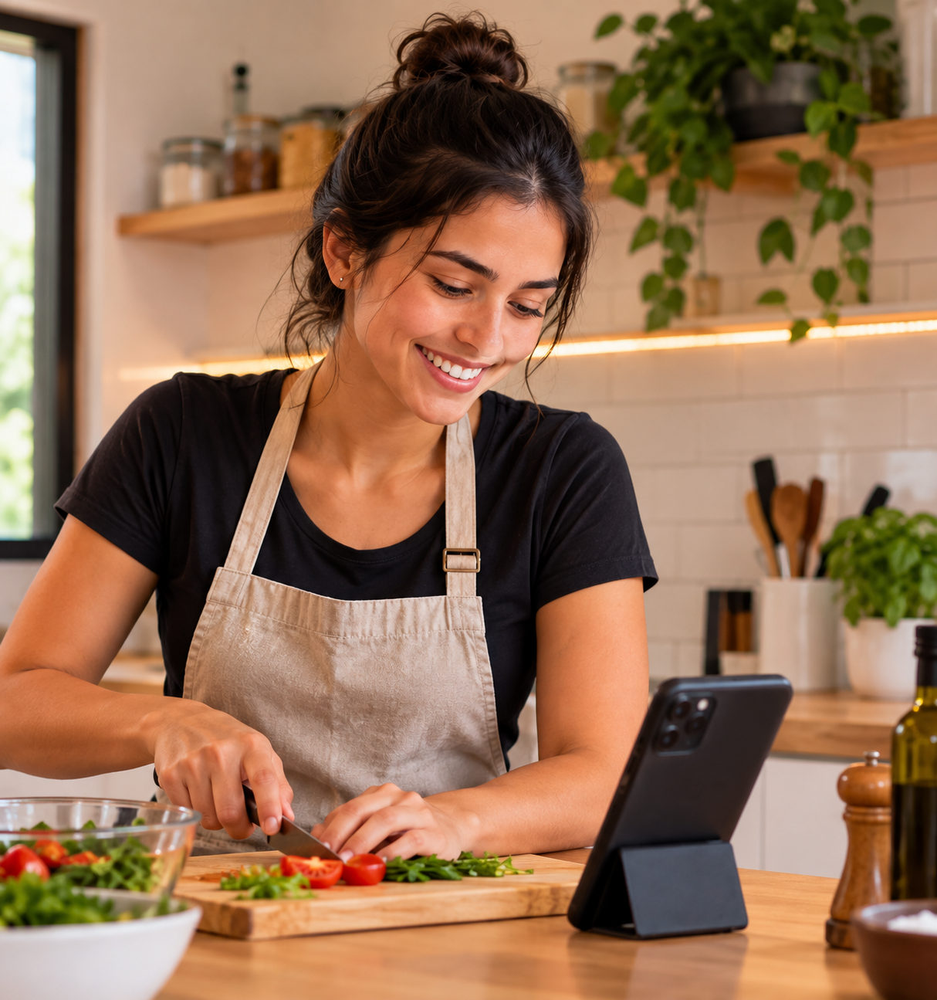
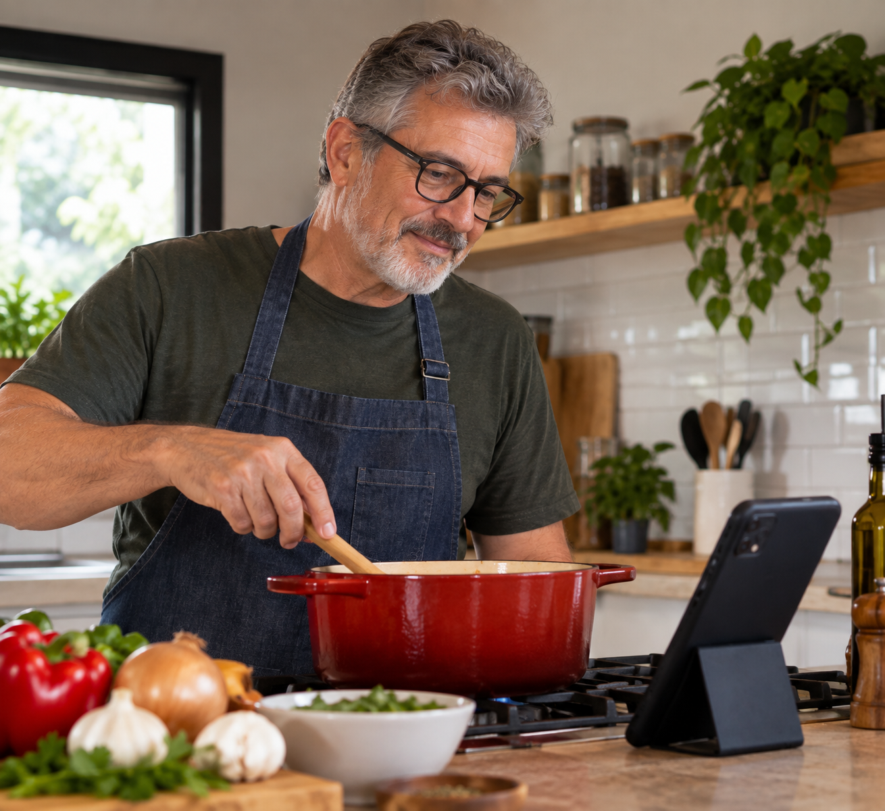

# 🍳 Projeto de UX/UI — Redesign & Acessibilidade "Tudo Gostoso"

> Estudo de caso e redesign de interface focados em **Acessibilidade**, **Arquitetura de Informação** e **Usabilidade** para a plataforma de receitas *Tudo Gostoso*.

---

## 👥 Integrantes do Grupo

* 💻 [Enzo Gurgel](https://github.com/enzogurgel)
* 💻 [Ronald Neto](https://github.com/Ronaldneto)
* 💻 [Hiram Pessoa](https://github.com/hiramcarneiro-cmd)
* 💻 [Miguel Silva](https://github.com/miguelss-s)
* 💻 [César Augusto](https://github.com/cesargehre)

---

## 📌 Contexto e Problematização

A partir da análise de usabilidade do site **Tudo Gostoso**, identificamos oportunidades cruciais de melhoria na experiência do usuário durante o preparo de receitas.

* **O Problema:** Excesso de anúncios invasivos, má organização textual e layout poluído.
* **A Principal Dor:** A poluição visual gera distrações e aumenta o risco de cliques acidentais em banners — um ponto crítico para usuários idosos ou com tremores finos nas mãos.
* **Momento Crítico:** Durante a execução da receita, no qual o usuário perde visibilidade de informações essenciais (tempo de preparo, temperatura, proporção dos ingredientes).
* **Oportunidades:** Reestruturar a arquitetura de informação, otimizar o posicionamento de anúncios, melhorar a hierarquia tipográfica e permitir o envio de feedbacks visuais (fotos do prato pronto).

---

## 👤 Personas

<table align="center">
  <tr>
    <td align="center" width="33%">
       
      <b>Marina Sousa Cortez (25 anos)</b> 
      <i>A Jovem Conectada pelo Celular</i>
        
      <b>Desafio:</b> Tela pequena, anúncios que causam cliques acidentais enquanto cozinha. 
      <b>Necessidade:</b> Layout responsivo mobile, informações essenciais no topo e envio de foto de feedback.
    </td>
    <td align="center" width="33%">
       
      <b>Otávio Neto Rodrigues (58 anos)</b> 
      <i>O Cozinheiro Míope</i>
        
      <b>Desafio:</b> Dificuldade de leitura à distância (visão/miopia) e anúncios sobre o texto. 
      <b>Necessidade:</b> Tipografia legível/alta visibilidade, alto contraste e passos em destaque.
    </td>
    <td align="center" width="33%">
       
      <b>Matheus Saldanha Rios (34 anos)</b> 
      <i>O Usuário de Desktop</i>
        
      <b>Desafio:</b> Layout desorganizado que espalha conteúdo em telas grandes. 
      <b>Necessidade:</b> Estrutura em blocos bem definida, sem banners laterais piscando e vídeos de apoio.
    </td>
  </tr>
</table>

---

## 💡 Ideação e Agrupamento de Ideias

**Pergunta Orientadora:** *Como poderíamos melhorar a visualização do usuário sobre as receitas dentro do site?*

### Categorização das Ideias (Brainstorming)
* **💰 Monetização:** Assinatura VIP sem anúncios, anúncios em posições não invasivas.
* **🎥 Conteúdo:** Vídeos com cozinheiros dedicados, seção dedicada *"Kids Meal"*.
* **♿ Acessibilidade:** Ajuste/Aumento de fonte, suporte para deficiência visual.
* **💬 Interação Social:** Área de avaliações, envio de fotos de pratos finalizados e sistema de pontos.
* **🧩 Navegação:** Menu por etapas, blocos informativos bem delimitados (Ingredientes, Modo de Preparo, Tempo).

---

## 🎯 Seleção da Solução (Matriz de Decisão)

Avaliamos três conceitos principais em uma escala de **1 a 5**:

| Critério de Avaliação | Ideia 1: Receita Fácil (Foco em UX/Acessibilidade) | Ideia 2: Receita Fácil Social (Comunidade) | Ideia 3: Receita Fácil Premium (Assinatura) |
| :--- | :---: | :---: | :---: |
| Resolve o problema identificado | **5** | 3 | 4 |
| Atende às necessidades da persona | **5** | 3 | 4 |
| Melhora a Jornada do Usuário | **5** | 3 | 4 |
| Facilidade de uso | **5** | 2 | 4 |
| Viabilidade de implementação | **5** | 3 | 3 |
| Potencial de inovação | **3** | 5 | 4 |
| Valor gerado para o usuário | **5** | 3 | 4 |
| **PONTUAÇÃO TOTAL** | **33** | **22** | **27** |

### 🏆 Solução Escolhida: IDEIA 1 — "Receita Fácil"

A **Ideia 1** foi a vencedora devido aos seguintes fatores:
1. **Foco Direto nas Personas:** Prioriza idosos e pessoas com dificuldades visuais/motoras através do ajuste do tamanho do texto, contraste e menus por etapas.
2. **Eliminação do Excesso de Poluição:** Reduz o ruído visual sem impor barreiras de pagamento (como na Ideia 3) ou necessidades complexas de moderação de comunidade (como na Ideia 2).
3. **Alta Viabilidade:** Foca em melhorias de arquitetura de informação e usabilidade de implementação ágil e alto impacto.

---

## 📊 Entregáveis e Links Úteis

* 🎨 **Slides da Apresentação:** [Acessar apresentação no Canva](https://canva.link/kix3gb3gv1n5pza)
* 🌐 **Site Base Analisado:** [Tudo Gostoso](https://www.tudogostoso.com.br/)
